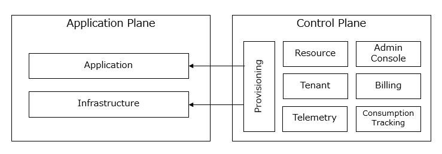
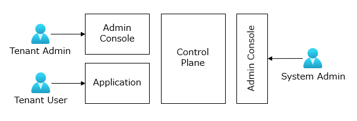

# マルチテナント アーキテクチャの全体像
マルチテナント アーキテクチャ全体の構造と概念を定義し、構築する優先度の高いアーキテクチャ要素を説明します。

## アプリケーション プレーンとコントロール プレーン
マルチテナント アーキテクチャは、アプリケーションプレーンとコントロールプレーンの 2 つの主要なコンポーネントで構成されます。

### アプリケーション プレーン
アプリケーション プレーンは、マルチテナント アーキテクチャに則って SaaS 製品の機能を具体化する部分です。テナントを適切に共有または分離することで、複数のテナントが利用できるアプリケーションを提供します。

### コントロール プレーン
コントロール プレーンは、リソースのプロビジョニング、テナントの管理、顧客への請求処理、監視など、すべてのテナントにまたがる機能を提供します。なお、コントロールプレーンの機能にマルチテナントの要素はありません。

## コントロール プレーンのスコープ定義
コントロール プレーン自体は顧客の価値に直結する部分ではないため、コントロール プレーンの構築にどのくらいの労力を費やすべきかを検討することが重要です。リソースのプロビジョニングとテナントの管理は優先度が高い機能です。すべての機能をスクラッチで構築せずとも、Azure が提供する標準機能を活用することで構築にかかる労力を最小限に抑えることもできます。

初回リリースのコントロール プレーンで提供する機能を決定してください。スコープ外の機能については、運用プロセスを整理して文書化しておくことで、その後のリリースで機能を迅速に提供できます。

## マルチテナント アプリケーションにおけるユーザーの役割
顧客側には、初期アカウントのテナント管理者ユーザーと一般のテナントユーザーが存在します。また、コントロール プレーンにアクセスしてマルチテナント アプリケーション全体を管理するシステム管理者ユーザーも存在します。

マルチテナント アーキテクチャを設計する際には、これらのユーザーの役割と権限を明確に定義し、各ユーザーがどのような操作を行うことができるかを検討します。
