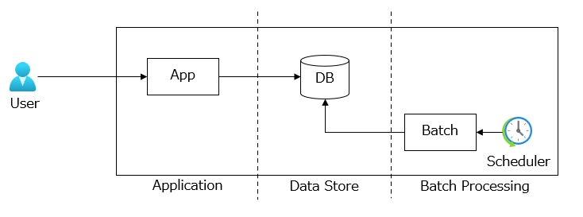

# テナント分離モデルの選択

マルチテナント アーキテクチャの設計で最大の考慮事項の１つは、テナント分離モデルです。コスト、セキュリティ、パフォーマンス、信頼性を考慮した上で、アーキテクチャのレイヤーごとに何を共有し、何を分離すべきかを決定します。  

## テナント分離モデル
テナントを分離するレベルを下げるほど、リソースの共有が増え、コストは低下しますが、セキュリティ、パフォーマンス、信頼性のリスクが高まります。逆に、テナントを分離するレベルを上げるほど、リソースの共有が減り、コストは増加しますが、セキュリティ、パフォーマンス、信頼性を向上させやすくなります。

Web アプリケーションを３つのレイヤーに分けて、テナント分離モデルの選択肢とそれぞれの特徴を説明します。

たとえば、アプリケーションではマルチテナントを選択し、データストアではテナントごとにデータベースを分けるといったように異なる分離レベルを選択することもできます。何を共有し、何を分離するかについての決定は、ビジネスゴールから抽出する機能要件および非機能要件に基づいて行います。

### [アプリケーション](./chapter03-01.md)
アプリケーションのテナント分離モデルを選択する際の考慮事項と、Azure サービスでの設計アプローチを説明します。

### [データストア](./chapter03-02.md)
データストアのテナント分離モデルは、データストアの構造や製品によって異なるため、Azure が提供する３つの主要なデータストアについて、考慮事項と設計アプローチを説明します。

### [バッチ処理](./chapter03-03.md)
バッチ処理のテナント分離モデルを選択する際の考慮事項と、Azure サービスでの設計アプローチを説明します。

## デプロイ スタンプ
テナント分離モデルのどのパターンを選択しても、テナント数やリソース消費の増加に伴いスケーリングを行う際に、[Azure リソースの制限](https://learn.microsoft.com/ja-jp/azure/azure-resource-manager/management/azure-subscription-service-limits)に達する可能性があります。  
デプロイ スタンプは、リソースを共有するテナントをグループ化して配置するパターンです。デプロイ スタンプを導入することで、Azure リソースの制限という制約を受けずにスケーリングを行うことができます。

Azure リソースのセットを複製することによる運用コストの増加が懸念されるため、デプロイ スタンプの導入にはプロビジョニング プロセスの自動化が不可欠です。インフラストラクチャをコードで管理することで、Azure リソースの作成、更新、削除を自動化し、運用コストを低減します。
