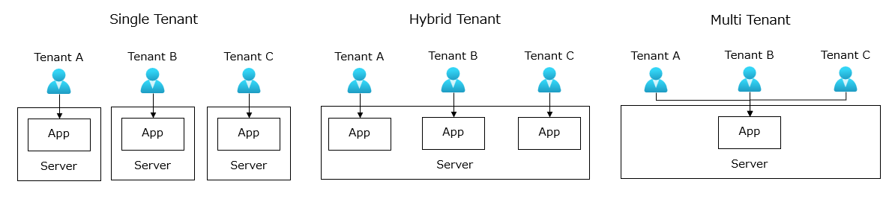
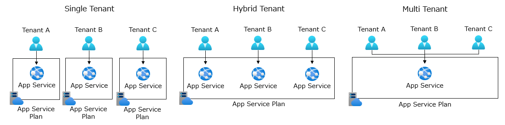
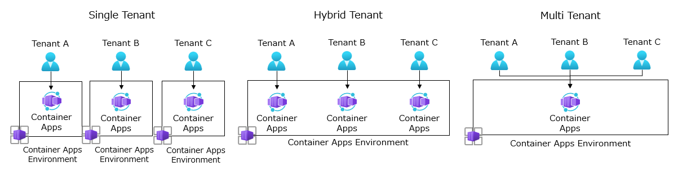

# テナント分離モデル - アプリケーション
アプリケーションのテナント分離モデルを選択する際の考慮事項と、Azure サービスでの設計アプローチを説明します。

## テナント分離モデル
アプリケーションのテナント分離モデルは、３つの主要なパターンがあります。

### シングルテナント
シングルテナントは、各テナントに対して独自のインスタンスを提供します。各テナントは、独自のアプリケーションインスタンス、およびリソースを持ちます。このモデルは、テナントごとに独自のカスタマイズや拡張を提供する必要がある場合に適しています。

リスクとしては、テナントごとにリソースを提供するため、課金コストが高くなる可能性があります。また、テナントごとにアプリケーションの更新プログラムを展開するため、運用プロセスの自動化が必要です。

### ハイブリッドテナント
ハイブリッドテナントは、シングルテナントとマルチテナントのハイブリッドです。各テナントは、リソースを共有しながら、独自のアプリケーションインスタンスを持つことができます。このモデルは、テナントごとに異なるコンフィグレーションが必要な場合に適しています。

リスクとしては、バランスが取れた選択である半面、シングルテナントとマルチテナントの両方のリスクを抱える可能性があります。

### マルチテナント
マルチテナントは、複数のテナントが共有する単一のインスタンスを提供します。各テナントは、共通のアプリケーションインスタンス、およびリソースを共有します。このモデルは、テナントごとのカスタマイズや拡張が必要ない場合に適しています。

リスクとしては、テナント間でリソースを共有するため、セキュリティやパフォーマンスの課題が発生する可能性があります。

> [!IMPORTANT]
> マルチテナントのパターンを採用する際には、アプリケーションの設計において、テナント ID などの識別子からテナントを判別してアプリケーションの振る舞いを変えたり、接続先のデータストアを切り替えたりする仕組みが必要となります。  
> 詳細は、[「4章 テナント管理」](./chapter04.md)の章を参照してください。

## Azure サービスで設計する際のアプローチ
Azure の PaaS を使用して、アプリケーションのテナント分離モデルを設計する際のアプローチは以下の通りです。

### Azure App Service
Azure App Service は、Web アプリケーションを簡単に構築、デプロイ、スケール、管理できるサービスです。App Service Plan は、Web アプリケーションを実行するための環境であり、各テナントごとにアプリケーションを分離することができます。

### Azure Container Apps
Azure Container Apps は、コンテナー化されたアプリケーションを簡単にデプロイ、スケール、管理できるサービスです。Container Apps Environment は、コンテナー化されたアプリケーションを実行するための環境であり、各テナントごとにアプリケーションを分離することができます。

