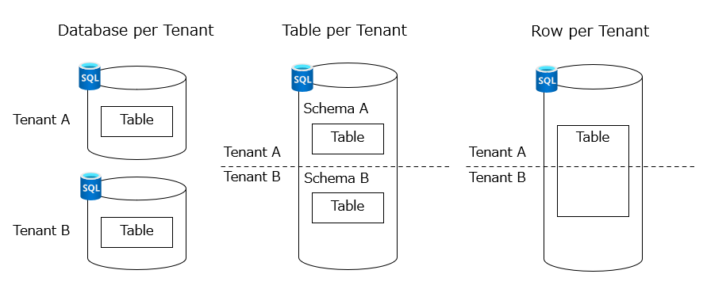
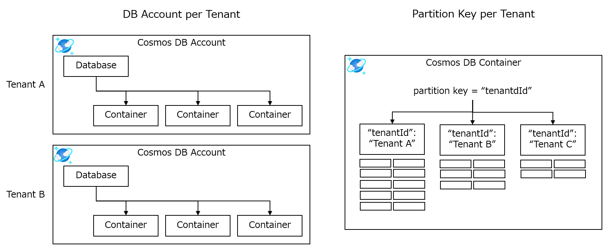
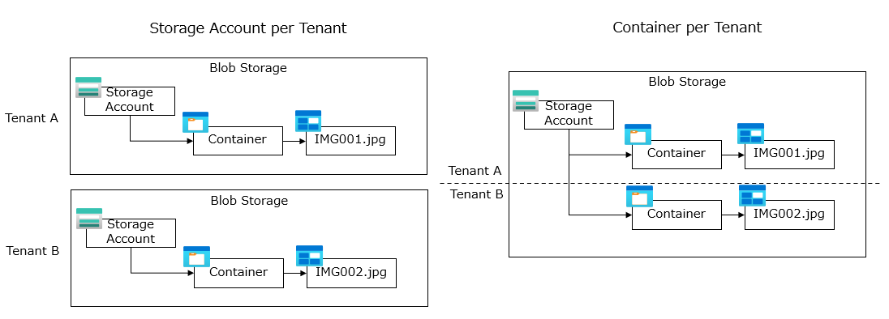

# テナント分離モデル - データストア
データストアのテナント分離モデルは、データストアの構造や製品によって異なるため、Azure が提供する3つの主要なデータストアについて、考慮事項と設計アプローチを説明します。

## リレーショナルデータベース
Azure が提供するリレーショナルデータベースの SQL Database を例に、テナント分離モデルと設計アプローチを説明します。  
SQL Database のテナント分離モデルは、３つの主要なパターンがあります。

### テナント毎のデータベース
データベースでテナントを分離する場合、各テナントに対して独自のコンピューティングリソースを提供します。各テナントは、独自のスキーマとテーブルを持ちます。このモデルは、テナントごとに独自のセキュリティやバックアップを提供する必要がある場合に適しています。

リスクとしては、テナントごとにデータベースを提供するため、課金コストが高く、運用管理が複雑になる可能性があります。
> [!TIP]
> SQL Database のほかに２つのデプロイオプションがありますので、Azure リソース選定時に検討してください。
> - [SQL Elastic Pool](https://learn.microsoft.com/ja-jp/azure/azure-sql/database/elastic-pool-overview?view=azuresql)  
> 負荷特性の異なる複数のデータベースを効率よく管理できます。大規模なマルチテナント アプリケーションに適しています。
> - [SQL Managed Instance](https://azure.microsoft.com/ja-jp/services/azure-sql/sql-managed-instance/)  
> オンプレミスの SQL Server との互換性が高いです。データベース単位ではなく、サーバー単位の課金となるため、課金コストを低く抑えたい場合に適しています。

### テナント毎のテーブル
テーブルでテナントを分離する場合、各テナントに対して共通のデータベースを提供します。テナントごとにスキーマを分けることによってデータベースを論理的に分離します。このモデルは、データベースを共有することでコスト効率を高めたい場合に適しています。

リスクとしては、バランスが取れた選択である半面、データベース分離とレコード分離の両方のリスクを抱える可能性があります。テナントごとにスキーマを構築するプロビジョニング プロセス、およびアプリケーション側でのテナントとスキーマのマッピングを行う必要があります。

### テナント毎のレコード
レコードでテナントを分離する場合、各テナントに対して共通のテーブルを提供します。各テナントは、テナント ID の列によってレコードを論理的に分離します。このモデルは、テナントごとにテーブルや列のカスタマイズが必要ない場合に適しています。

リスクとしては、テナント間でテーブルを共有するため、セキュリティやパフォーマンスの課題が発生する可能性があります。アプリケーション側のセキュリティ設計の複雑さを軽減するため、[行レベルセキュリティ](https://learn.microsoft.com/ja-jp/sql/relational-databases/security/row-level-security?view=sql-server-ver16) の導入を検討してください。

## 非リレーショナルデータベース（NoSQL）
Azure が提供する非リレーショナルデータベース（NoSQL）の Cosmos DB を例に、テナント分離モデルと設計アプローチを説明します。  
Cosmos DB のテナント分離モデルは、２つの主要なパターンがあります。

### テナント毎のデータベースアカウント
データベースアカウントでテナントを分離する場合、各テナントに対して独自のスループットを提供します。各テナントは、独自のコンテナーを持ちます。このモデルは、テナントごとに独自のセキュリティや geo レプリケーションを提供する必要がある場合に適しています。

リスクとしては、テナントごとにデータベースを提供するため、課金コストが高く、運用管理が複雑になる可能性があります。また、Azure サブスクリプションあたりのデータベースアカウントの最大数（250個）を考慮してください。

### テナント毎のパーティションキー
パーティションキーでテナントを分離する場合、スループットはテナント間で共有され、同一コンテナー内で管理されます。パーティションキーには、テナント ID を使用します。このモデルは、課金コストを低く抑えて、運用管理を簡素化したい場合に適しています。

リスクとしては、テナント間でスループットを共有するため、スループット消費の多いテナントの影響を他のテナントが受ける可能性があります。

## ファイルストア
Azure が提供するファイルストアの Blob Storage を例に、テナント分離モデルと設計アプローチを説明します。  
Blob Storage のテナント分離モデルは、２つの主要なパターンがあります。

### テナント毎のストレージアカウント
ストレージアカウントでテナントを分離する場合、各テナントに対して独自のストレージアカウントを提供します。各テナントは、独自の Blob コンテナーを持ちます。このモデルは、テナントごとに独自のセキュリティや冗長オプションを提供する必要がある場合に適しています。

リスクとしては、テナントごとにストレージアカウントを提供するため、運用管理が複雑になる可能性があります。また、Azure サブスクリプションあたりのストレージアカウントの最大数（500個）を考慮してください。

### テナント毎の Blob コンテナー
Blob コンテナーでテナントを分離する場合、各テナントに対して共通のストレージアカウントを提供します。各テナントは、Blob コンテナー内の Blob にテナント ID のプレフィックスを付与して論理的に分離します。このモデルは、テナントごとにストレージアカウントを提供することなく、コスト効率を高めたい場合に適しています。

リスクとしては、ストレージアカウントを共有することによるクォータと制限がありますが、Blob Storage は非常にスケーラブルなサービスであるため、大きな考慮事項にはなり得ないケースが多いです。

> [!WARNING]
> Blob コンテナーをテナントで共有して Blob パスでテナントを分離する場合、Blob Storage でテナントごとにアクセス権を割り当てできないため、注意してください。  

