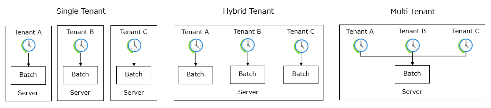
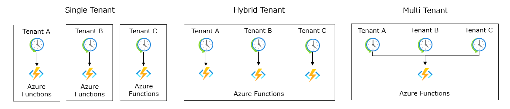
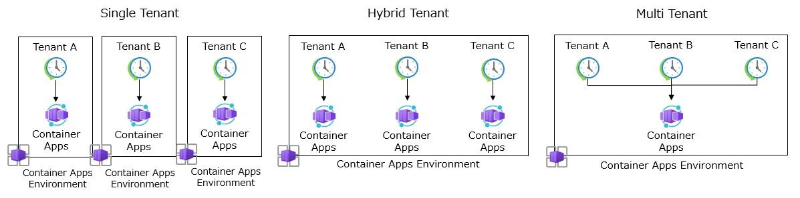

# テナント分離モデル - バッチ処理
バッチ処理のテナント分離モデルを選択する際の考慮事項と、Azure サービスでの設計アプローチを説明します。

> [!TIP]
> イベント駆動での処理が可能であれば、バッチ処理を構築する必要がない場合もあります。Azure リソースを利用することで、比較的容易に[イベントソーシング](https://learn.microsoft.com/ja-jp/azure/architecture/patterns/event-sourcing)のパターンを構築できます。 

## テナント分離モデル
バッチ処理のテナント分離モデルは、３つの主要なパターンがあります。

### シングルテナント
シングルテナントは、各テナントに対して独自のインスタンスを提供します。各テナントは、独自のバッチ処理インスタンス、およびリソースを持ちます。このモデルは、テナントごとに独自のカスタマイズや拡張を提供する必要がある場合に適しています。

リスクとしては、テナントごとにリソースを提供するため、課金コストが高くなる可能性があります。また、テナントごとにバッチ処理の更新プログラムを展開するため、運用プロセスの自動化が必要です。

### ハイブリッドテナント
ハイブリッドテナントは、シングルテナントとマルチテナントのハイブリッドです。各テナントは、リソースを共有しながら、独自のバッチ処理インスタンスを持つことができます。このモデルは、テナントごとに異なるコンフィグレーションが必要な場合に適しています。

リスクとしては、バランスが取れた選択である半面、シングルテナントとマルチテナントの両方のリスクを抱える可能性があります。

### マルチテナント
マルチテナントは、複数のテナントが共有する単一のインスタンスを提供します。各テナントは、共通のバッチ処理インスタンス、およびリソースを共有します。このモデルは、テナントごとのカスタマイズや拡張が必要ない場合に適しています。

リスクとしては、テナント間でリソースを共有するため、セキュリティやパフォーマンスの課題が発生する可能性があります。

> [!IMPORTANT]
> マルチテナントのパターンを採用する際には、バッチ処理の設計において、テナント ID などの識別子からテナントを判別してバッチ処理の振る舞いを変えたり、接続先のデータストアを切り替えたりする仕組みが必要となります。  
> 詳細は、[「4章 テナント管理」](./chapter04.md)の章を参照してください。

## Azure サービスで設計する際のアプローチ
定期実行されるバッチ処理の特性上、必要ない時間帯は実行インスタンスをゼロにできるサーバーレスのアーキテクチャを採用します。  
Azure サービスを使用して、バッチ処理のテナント分離モデルを設計する際のアプローチは以下の通りです。

### Azure Functions
Azure Functions は、サーバーレスのコンピューティング サービスであり、イベントに応じてコードを実行できるため、バッチ処理に適しています。バッチ処理は、実行時間が長くなる可能性があるため、Durable Functions を使用して長時間実行されるバッチ処理を分割して並列処理することができます。バッチ処理（関数）をテナントごとに分離することができますし、複数のテナントで共有するバッチ処理（関数）を提供することもできます。

### Azure Container Apps
Azure Container Apps は、コンテナー化されたアプリケーションを簡単にデプロイ、スケール、管理できるサービスであり、イベントに応じてコンテナーを実行できるため、バッチ処理に適しています。バッチ処理（コンテナー）をテナントごとに分離することができますし、複数のテナントで共有するバッチ処理（コンテナー）を提供することもできます。

