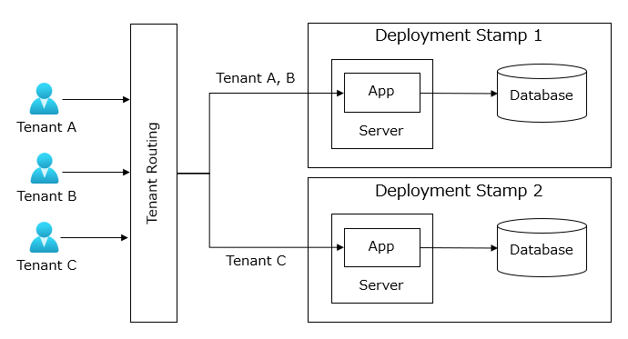
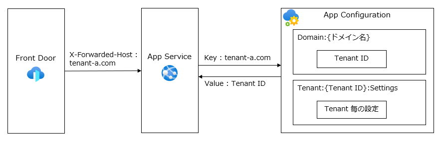
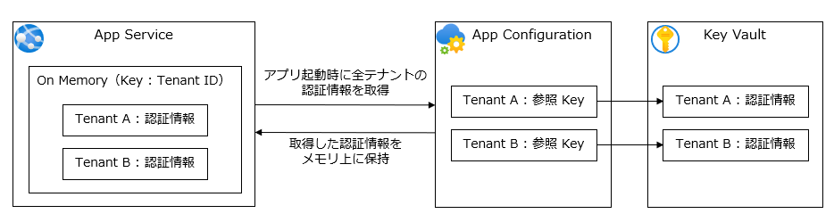
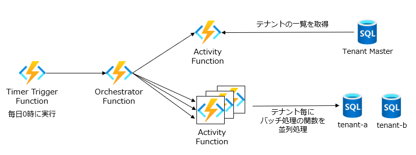

# テナント管理
マルチテナント アプリケーションの設計において、テナント ID などの識別子からテナントを判別する方法について説明します。また、テナントの無効化や削除、デプロイ スタンプ間の移動など、テナントのライフサイクルについても説明します。

## テナントのルーティング
アプリケーションでは、各テナントのユーザーからの HTTP リクエストを受け取った際に、どのテナントなのかを判別してアプリケーションの振る舞いを変えたり、接続先のデータストアを切り替えたりする仕組みが必要となります。



このセクションでは、HTTP リクエストを適切なテナントにルーティングするための Azure サービスでの設計アプローチを説明します。



Azure Front Door でカスタムドメインや CDN などを構成し、受信したリクエストを適切なデプロイ スタンプにルーティングします。ルーティングする際には X-Forwarded-Host ヘッダーにテナントのドメイン名を設定し、Azure App Service のアプリケーション側でそのヘッダーを参照してテナントを識別します。

> [!TIP]
> 受信したリクエストからテナントを識別する方法は、X-Forwarded-Host ヘッダー以外にも複数ありますので、アプリケーションの要件に合わせて適切な方法を選択してください。
> - URL パス（https://example.com/tenant-a/）
> - URL 内のクエリ文字列（https://example.com?tenant=tenant-a/）
> - カスタム HTTP 要求ヘッダー（X-Tenant-Id:tenant-a）

取得したドメイン名をキーとして Azure App Configuration からテナント ID を取得し、テナント ID に対応する構成情報として接続先のデータベースやストレージアカウントなどを取得します。

Azure App Configuration では、構成情報を表すキーと値のペアを管理できますが、キーには階層的な名前を使用できます。キープレフィックスにテナント ID を使用することをお勧めします。

```json
{
  "tenant:tenant-a:settings:TenantName": "テナントA",
  "tenant:tenant-b:settings:TenantName": "テナントB",
  "sentinel:tenant-a": "20250131173010",
  "sentinel:tenant-b": "20250331091045",
}
```

構成情報が必要なたびに App Configration から取得するとパフォーマンスへの影響が考慮されるため、アプリケーション起動時にすべてのテナントの構成情報をオンメモリにキャッシュすることを検討してください。キープレフィックスのフィルターを指定して、単一テナントのキーのみ読み込むことができます。また、Sentinel Key を登録しておくことで、構成情報の変更を検知してキャッシュを更新する仕組みを実装することができます。

テナントごとの接続先データベースの ConnectionString や 外部 API Key などのセンシティブ情報は Azure Key Vault に保存し、Azure App Configuration から参照するようにします。この Key Vault 参照によって、Azure Key Vault 自体への認証情報を管理する手間を省きます。



> [!TIP]
> 上記の説明では、Azure Front Door をテナント共通リソースとして、デプロイ スタンプの外に配置しています。  
> Azure Front Door に適用されるクォータと制限を考慮して、Azure Front Door をデプロイ スタンプ内に配置することも検討してください。
> - Azure サブスクリプションあたりのプロファイルの最大数（500）
> - プロファイルあたりのカスタムドメインの最大数（100～500） など

## テナントの並列処理
バッチ処理では、バッチ処理コードを１つだけデプロイし、テナント毎にインスタンスをスケールアウトさせる仕組みが必要となります。  
このセクションでは、定期実行するバッチ処理をテナントごとに並列処理させるための Azure サービスでの設計アプローチを説明します。



Durable Functions のファンアウト パターンでバッチ処理を並列実行させます。オーケストレーター関数は、タイマートリガーで定期実行させて、テナントの一覧を取得するアクティビティ関数を呼び出した後、テナントごとにバッチ処理のロジックを実装したアクティビティ関数を並列に呼び出します。  
なお、構成情報や認証情報については、前述したアプリケーションと同様の仕組みを実装します。

## テナントのライフサイクル
テナントの追加と更新のほかにも、サービスの利用終了による無効化やリソースの平準化を目的としたデプロイ スタンプ間の移動など、ライフサイクルの各ステージについて説明します。  

### テナントの無効化
テナントの無効化は、顧客が SaaS 製品を利用終了することにより、そのテナントがシステムにアクセスできないようにすることです。あくまで一時的な無効化であり、再有効化される可能性もあります。  
前述したテナントのルーティングの仕組みを利用して、無効化フラグが立っているテナントに対しては、アプリケーションの振る舞いを変更してアクセスを制限することを検討してください。

### テナントの削除
テナントの削除は、テナントのデータを永続化する必要がない場合に行います。まずはテナントを無効化し、一定期間経過後に削除します。  
事前にテナントの削除手順を定義しておくことで、テナントの削除時に必要な作業を漏れなく実行できます。

### デプロイ スタンプ間の移動
デプロイ スタンプ間の移動は、リソースの平準化を目的として、テナントを別のデプロイ スタンプに移動します。  
事前にデプロイ スタンプ間の移動手順を定義しておくことで、テナントの移動時に必要な作業を漏れなく実行できます。
