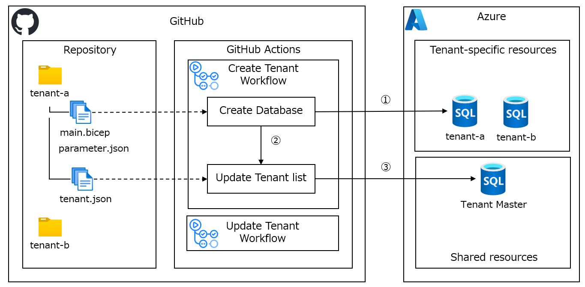
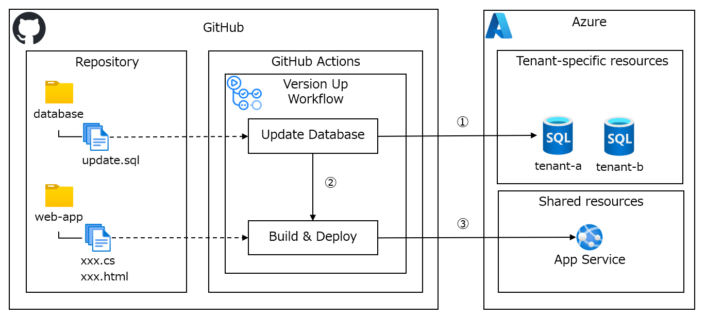
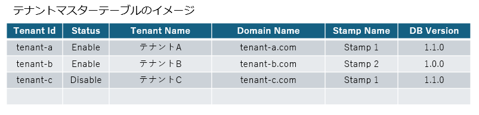
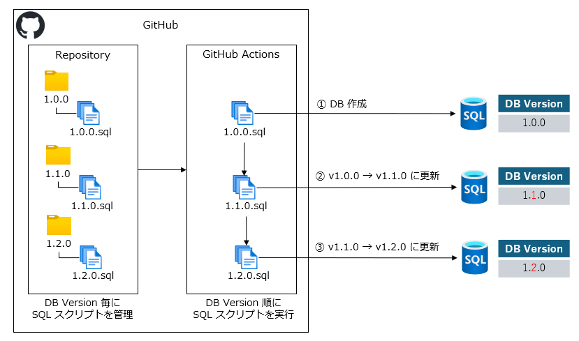
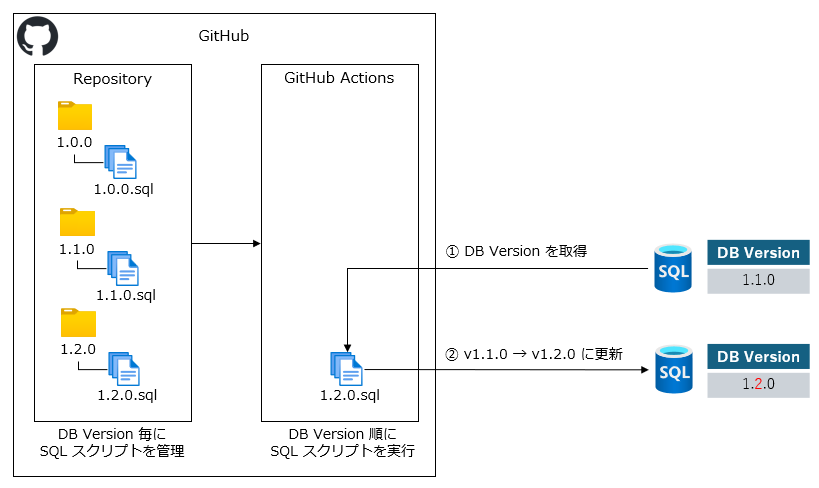

# プロビジョニングの自動化
マルチテナント アプリケーションの更新プログラムの展開に加えて、テナントの追加や更新に関連するプロビジョニング プロセスを自動化する方法について説明します。

## 自動化の重要性
マルチテナント アーキテクチャの設計でテナント分離モデルの次に重要なのが、プロビジョニングの自動化です。プロビジョニングの自動化により、次のような利点が得られます。
- テナント数の増加に伴う運用コストの増加を抑える。
- 手動のプロビジョニングによるヒューマンエラーを減らす。
- マルチテナント環境の再現性を担保する。

## 自動化のスコープ定義
ビジネスゴールから機能要件を抽出し、プロビジョニングの自動化対象となる運用シナリオとその内訳タスクを定義します。

### 運用シナリオの整理
マルチテナント アプリケーションの運用業務のなかで、テナントの追加や更新、バージョンアップ、スタンプの追加などのプロビジョニングに関連するシナリオを整理します。

| 運用シナリオ | 説明 |
| --- | --- |
| 環境構築 | 初回の環境構築時に、コントロールプレーンとアプリケーションプレーンを作成します。 |
| テナント追加 | 新規顧客との契約締結後に、テナントのリソースを追加します。 |
| バージョンアップ | マルチテナント アプリケーションの更新において、アプリケーション、データストア、バッチ処理などのリソースを更新します。 |
| テナント更新 | 顧客の契約プラン変更によってマルチテナントアプリケーションの振る舞いを変更する場合、テナントの構成情報を更新します。また、テナントの有効無効の切り替えも行います。 |
| スタンプ追加 | テナント数やリソース消費の増加に伴い、新しいスタンプを追加してスケーラビリティを確保します。 |

テナントの追加や更新とバージョンアップは、マルチテナント アプリケーションの運用業務において頻繁に発生するため、自動化の最優先候補です。一方、環境構築やスタンプ追加は、初回の環境構築時やテナント数の増加に伴い発生するため、自動化の優先度を下げることができます。

### 運用シナリオのブレイクダウン
運用シナリオをさらにブレイクダウンし、実行するタスクを整理します。運用チームが行うタスクだけでなく、顧客との契約や請求などの業務チームが行うタスクも含めて整理します。  
新しいテナントを追加する場合のタスク例を以下に示します。
1. 顧客との契約締結
2. CRM システムへの登録（テナント ID の発行を含む）
3. テナントの Azure リソースの構築
4. ドメイン、SSL 証明書、DNS レコードの設定
5. テナントの管理者アカウントを作成し、その資格情報を顧客に通知する

テナントの Azure リソースの構築は、最も時間がかかりヒューマンエラーの発生する可能性の高いタスクの一つであるため、自動化の最優先候補です。初回リリースでは運用シナリオの実施手順を整理したうえで最低限の自動化機能をリリースし、その後のリリースでプロビジョニングの自動化範囲を拡張していくことをお勧めします。

## Git リポジトリによるリソース構成管理とプロビジョニング
マルチテナント アプリケーションの Azure リソースは、コードで管理することを推奨します。Bicep や Terraform などのインフラストラクチャ コードを GitHub や Azure DevOps の Git リポジトリで管理することで、リソース構成の変更履歴を管理し、再現性を担保することができます。

GitHub Actions や Azure Pipelines を作成することで、リソース構成の変更をワークフローで自動化することができます。リソース構成変更のコードレビューに加えて、ワークフロー実行の承認フローを組み込むこともできます。

### テナント追加

### バージョンアップ

## テナントマスターの管理
前述したように、テナント ID とドメイン名のマッピング、テナントの有効無効などのメタデータは、Git リポジトリで静的ファイルとして管理することで、プロビジョニングを自動化するワークフローのパラメータとして利用できます。

一方で、テナントのメタデータやスタンプの情報をリスト表示するシステム管理者向けのコンソールも必要です。テナントマスターの管理コンソールでは、テナントの追加や更新、バージョンアップの実行履歴を確認できるようにすることで、運用チームがプロビジョニングの状況を把握しやすくなります。将来的には、テナントごとのリソース利用量やアクティブユーザー数などを表示する機能を拡張することも検討します。

## データベースバージョンの導入
マルチテナント アプリケーションのリレーショナルデータベースでは、テーブルや列の追加するための SQL スクリプトを実行するコストが高く、ヒューマンエラーのリスクが高いため、データベースバージョンの導入を検討してください。

データベースバージョンは、データベースのスキーマやデータのバージョンを管理するための仕組みです。データベースバージョンの導入は、テナント追加とバージョンアップのプロビジョニングを自動化するための重要な要素です。

### データベースバージョンの管理方針
- データベースバージョンを管理するためのテーブルを作成する。
- バージョンごとにスキーマ更新とデータ補完する SQL スクリプトを Git リポジトリで管理する。
- テナント追加とバージョンアップのワークフローの中で適切にデータベースバージョンを更新する。

### テナント追加時のデータベースバージョンの適用
テナント追加時には、データベースバージョン順に SQL スクリプトを実行します。

### バージョンアップ時のデータベースバージョンの適用
バージョンアップ時には、データベースの現在のバージョンの次バージョンから SQL スクリプトを実行します。

